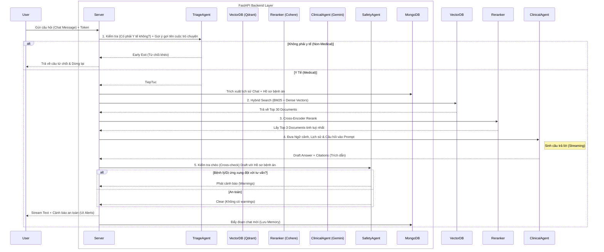

# 🏥 Medical AI Assistant (RAG) - Hệ Sinh Thái Y Tế Thông Minh

Đây là dự án hệ thống Trợ lý Y tế thông minh được xây dựng trên nền tảng **RAG (Retrieval-Augmented Generation)** kết hợp cùng cấu trúc **Heterogeneous Multi-Agent** (Đa Tác nhân Dị biến). Dự án ứng dụng nhiều công nghệ tiên tiến nhất nhằm tạo ra một chatbot y tế không chỉ phản hồi đúng chuyên môn từ bộ dữ liệu ViHealthQA, mà còn cực kỳ **an toàn (clinical safety)** đối với sức khỏe cá nhân của từng bệnh nhân.

---

## 🚀 1. Tổng Quan Kiến Trúc & Công Nghệ (Tech Stack)

Hệ thống được module hóa cao với sự tham gia của các công nghệ hiện đại hàng đầu.

### 🎨 Frontend
- **React.js**: Thư viện cốt lõi xây dựng UI/UX (Single Page Application).
- **Trải nghiệm ChatGPT-like**: Hỗ trợ streaming text mượt mà, cuộn tự động (Focus mode), và các nút tương tác thả nổi.
- **Vanilla CSS**: Tập trung vào thẩm mỹ hiện đại, hiệu ứng kính (glassmorphism), Dark/Light theme, Animations mượt mà thay vì dùng thư viện cồng kềnh.
- **Clerk Authentication**: Tích hợp SSO (Google, Github), quản lý Session Authentication và Webhooks ngay trên Frontend.

### ⚙️ Backend (Tầng Xử lý & AI)
- **FastAPI**: Backend Framework siêu tốc chạy Python bất đồng bộ (Asynchronous).
- **Gemini 2.5 Flash**: Agent tạo sinh (Generator) chính. Đọc ngữ cảnh RAG và cho ra các giải thích y học phức tạp kèm trích dẫn.
- **Llama 3.3 70B (Groq)**: Xử lý 2 Tác nhân hỗ trợ là **Triage Agent** (phân loại ý định, từ chối câu hỏi hệ thống ngoài chuyên môn) và **Safety Guard Agent** (kiểm định an toàn y tế dựa trên hồ sơ bệnh án).
- **Cohere Rerank V4**: Tối ưu lại (Cross-Encoder) danh sách các tài liệu lấy từ DB để đảm bảo Context top đầu luôn liên quan nhất.
- **Resend**: Dịch vụ Mail Delivery tự động bắn Onboarding/Welcome Message một cách chuyên nghiệp.

### 💾 Cơ Sở Dữ Liệu (Databases)
- **Qdrant Cloud**: Vector Database kết hợp **Hybrid Search** (Dense Vector qua `vi-bi-encoder` + Sparse Vector BM25 qua `fastembed`). Sử dụng Prefetch + Fusion RRF Native cho tốc độ và độ chính xác tối ưu.
- **MongoDB Atlas**: Lưu trữ Memory Chat History liên tục, quản lý vòng đời Session và Hồ sơ sức khoẻ bệnh nhân (Health Profiles).

---

## 🧠 2. Luồng Hoạt Động Cốt Lõi (Architecture Flow)

Dưới đây là sơ đồ diễn đạt luồng xử lý truy vấn từ lúc Server tiếp nhận câu hỏi của người dùng cho đến khi trả về luồng chữ (Stream).



### Các Luồng Nổi Bật Khác
- **Luồng Đăng ký (Onboarding):** Khi User trỏ tới app qua Clerk -> Auth Token hợp lệ -> Lần đầu API phát hiện User mới -> Bắn API qua Resend gửi Welcome Email -> UI Backend yêu cầu điền Form Profile.
- **Luồng Quản Lý Phiên Chat:** Hỗ trợ tính năng đổi tên (Rename Modal), Ghim (Pin) lên đầu danh sách và Xoá bằng giao diện cửa sổ Floating 3-Dots Menu.

---

## 🛠️ 3. Hướng Dẫn Cài Đặt (Setup & Deploy)

### Yêu Cầu Cấu Hình
- Python 3.10 trở lên
- Node.js 18+ (Dành cho bản Build Frontend)
- Các tài khoản API: Gemini, Groq, Cohere, Clerk, Resend.

### Bước 1: Khởi Tạo API Keys (.env)
Tại thư mục `backend`, nhân bản file `.env.example` thành `.env`:

```env
# AI Models
GEMINI_API_KEY=xxx
GEMINI_MODEL=gemini-2.5-flash
GROQ_API_KEY=xxx
GROQ_MODEL=llama-3.3-70b-versatile
COHERE_API_KEY=xxx

# Qdrant Database
QDRANT_MODE=cloud
QDRANT_CLOUD_URL=https://<id>.qdrant.io:6333
QDRANT_API_KEY=xxx
QDRANT_COLLECTION=vnhealthqa

# MongoDB Database
MONGODB_URL=mongodb+srv://admin:<password>@cluster0.xxx.mongodb.net/?retryWrites=true&w=majority&appName=Cluster0

# Clerk & Resend
CLERK_JWKS_URL=https://<your_clerk_domain>/.well-known/jwks.json
CLERK_ISSUER=https://<your_clerk_domain>
RESEND_API_KEY=re_xxx
RESEND_FROM_EMAIL=onboarding@resend.dev
```

### Bước 2: Setup Backend và Vector Database
```bash
# 1. Kích hoạt môi trường và cài đặt Gói (Thực thi trong thư mục root)
cd backend
python -m venv venv
venv\Scripts\activate
pip install -r requirements.txt

# 2. Xây dựng Database Vector
# Đảm bảo file train_clean.csv và val_clean.csv đang nằm trong mục data/ ở root project
# Tập lệnh này sẽ đẩy ĐỒNG THỜI Train/Val lên hệ thống Qdrant.
python scripts/index_data.py

# 3. Chạy Server
uvicorn main:app --reload --host 0.0.0.0 --port 8000
```
Backend sẽ khởi chạy ở `http://localhost:8000`.

### Bước 3: Setup Frontend
Tạo file `.env` nằm trong thư mục `frontend`:
```env
REACT_APP_CLERK_PUBLISHABLE_KEY=pk_test_xxxxxxxxxxxxxxxxxxxxxxxxxxx
```
Xây dựng giao diện:
```bash
cd frontend
npm install
npm start
```
Frontend sẽ phản hồi ở `http://localhost:3000`.

*(Để deploy hệ thống lên Production như Vercel/Render, bạn chỉ cần chạy lệnh `npm run build` cho folder React và trỏ Backend endpoint URL vào file cấu hình.)*

---

## 📌 Các Tính Năng Đã Mở Khóa Đáng Chú Ý (Changelog)
- Đăng nhập đa tài khoản liền mạch (Multi-Session Switcher).
- Cơ chế AI Tự động định danh đoạn hội thoại (Triage AI Auto Titling).
- Sliding Window Context Memory - Không bao giờ tràn Token Context bằng cách thiết lập chặn Sliding-Window Pydantic cho Chat History.
- Trích xuất tài liệu nguồn bằng Card Hover CSS UI.

*Chúc mọi người có một kỳ Khóa Luận Tốt Nghiệp / Triển khai dự án thành công rực rỡ!* 🎓
